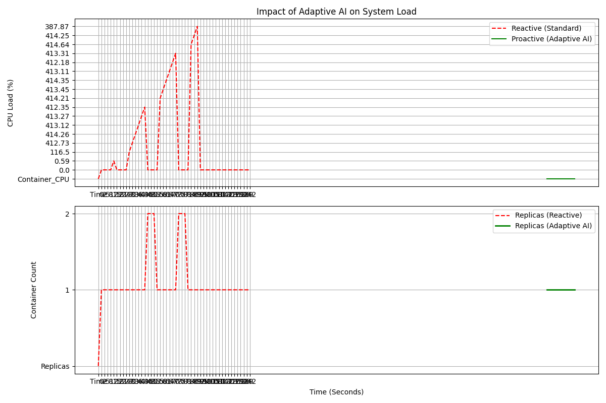

# Proactive Container Orchestrator 

**A Deep Learning-based OS Scheduler for Docker Swarm**

##  Overview
Traditional cloud auto-scalers are **Reactive**—they wait for a system crash or high CPU usage before adding resources. This causes "Cold Start Latency," where users experience downtime while new containers boot up.

This project implements a **Proactive Orchestrator** using an **LSTM Neural Network**. Trained on the **Bitbrains Datacenter Trace** (1,250 VMs), it predicts traffic spikes 60 seconds in advance and scales resources *before* the load hits, ensuring Zero Downtime.

##  Key Features
* **Universal AI Model:** Trained on diverse datacenter traces to learn general cloud patterns.
* **Adaptive Thresholding:** Uses statistical variance (Volatility) to dynamically adjust sensitivity.
* **Robust Monitoring:** Custom low-level Docker socket parser for real-time, high-precision metrics.
* **Deadlock Avoidance:** Acts as a "Predictive Banker's Algorithm" to prevent resource starvation.

##  Architecture
1.  **The Observer (`logger.py`):** Monitors Docker Swarm metrics in real-time.
2.  **The Brain (`orchestrator.py`):** An LSTM model that forecasts future load.
3.  **The Enforcer:** Scales services based on Adaptive Logic (Prediction vs. Volatility).

##  Results
We compared this system against a standard Reactive Auto-scaler using `stress-ng` attacks.
* **Reactive:** Crashed. CPU hit 200% saturation before scaling.
* **Proactive (Ours):** Predicted the spike. Scaled pre-emptively. CPU load remained stable.



## 💻 Installation & Usage

### 1. Setup
```bash
git clone [https://github.com/YOUR_USERNAME/AI-Orchestrator-OS.git](https://github.com/YOUR_USERNAME/AI-Orchestrator-OS.git)
cd AI-Orchestrator-OS
pip install -r requirements.txt
